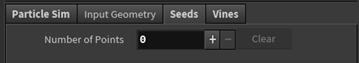

# Climbing Plant Simulation for Houdini
CIS497: DMD Senior Design Project
======================

ABSTRACT:
------------

Based on the work of _Hädrich et al_ in their 2017 paper Interactive Modeling and Authoring of Climbing Plants, I will be implementing a tool for modeling and animating climbing plants in Houdini. The goal of this tool is to provide artists with a better way to quickly model realistic climbing plants in 3D environments. The algorithm presented in this paper treats plants as a collection of anisotropic particles that contain both “internal” pa-rameters, like velocity and orientation, as well as “external” parameters like available surfaces and sunlight. This tool will generate a plant model, and once the user is satisfied with the model, allow for export as an .obj. The user has some degree of control over 1) the leaves on the plant, 2) the density of the shoots, and 3) the var-iability in growth direction of new shoots. 

The final project itself is contained within the Houdini file-- the Python and C++ files are earlier attempts at the project.

TOOL BEHAVIOR:
------------

Plant seeds by clicking on the scene. Seeds can be added while the simulation is running as well.

Plants can be affected by phototropism (where the light in the scene is) and surface adaptation (growing over geometry). The following shows how results vary based on these properties:

**NO PHOTOTROPISM, NO SURFACE ADAPTATION**

**PHOTOTROPISM, NO SURFACE ADAPTATION**

**PHOTOTROPSIM, SURFACE ADAPTATION**

INTERFACE:
------------

The tool interface has the following input parameter controls, divided into 4 tabbed sections:

**PARTICLE SIMULATION**
- Gravity: global gravity value
These affect the overall growth direction of the plant:
- Velocity
- Anglar Velocity
- Orientation Value 
Surface Adaptation: toggle surface adaptation
- Adaptation Strength: strength of attraction to the geometry's surface
- Attract Range: how close to the surface the vine must be to be affected
Phototropism: toggle phototropism
- Phototropic Strength: strength of attraction to light
- Light Position: position of light
- Variabilty from Surface: how closely the vine sticks to the surface

**INPUT GEOMETRY**
- Voxel Size: level of detail for input geometry (converted to SDF)
- Exterior Band Voxels: affects input geometry SDF function range

**SEEDS**

This autopopulates with seed positions after the user clicks on the scene to place points, as shown in some of the earlier Tool Behavior screengrabs. 

**VINES**
- Preserve Geometry: percentage of geometry to keep (can be used to reduce polycount of vines)
- Thickness: determines vine diameter
- Leaf Density: determines density of leaves on vines
- Divisions: refers to vines' level of detail 